# CloudSecure IAM Architecture Project

## 🎯 Project Overview

A production-ready, multi-tier IAM (Identity and Access Management) architecture implementing security best practices including MFA enforcement, least privilege principle, and role-based access control.

**Project Duration:** February 4-10, 2026 (4 days)  
**Status:** ✅ Complete  
**Technologies:** AWS IAM, Terraform, Trust Policies, Permission Policies, MFA, Infrastructure as Code

---

## 📋 Table of Contents

- [Visual Architecture](#-visual-architecture)
- [Project Summary](#-project-summary)
- [Roles Created](#-roles-created)
- [Security Features](#-security-features)
- [Infrastructure as Code](#️-infrastructure-as-code)
- [Testing & Validation](#-testing--validation)
- [Key Learnings](#-key-learnings)
- [Challenges & Solutions](#-challenges--solutions)
- [Project Outcomes](#-project-outcomes)
- [Getting Started](#-getting-started)
- [Contact](#-contact)

---

## 📊 Visual Architecture

### System Overview

```mermaid
graph TB
    subgraph AWS["☁️ AWS Account: 103976430153"]
        Root["🔐 Root Account<br/>MFA Enabled ✓<br/>Emergency Use Only"]
        Admin["👤 admin-user<br/>IAM Admin<br/>MFA Enabled ✓<br/>AdministratorAccess"]
        
        subgraph Roles["IAM Roles (MFA Required)"]
            AdminRole["🎭 Cloud-Secure-Admin<br/>📋 AdministratorAccess<br/>Full AWS Access"]
            DevRole["🎭 CloudSecure-Developer<br/>📋 Custom Policy<br/>Limited Access"]
        end
        
        Admin -->|"AssumeRole"| AdminRole
        Admin -->|"AssumeRole"| DevRole
    end
    
    style Root fill:#ff9999
    style Admin fill:#99ccff
    style AdminRole fill:#99ff99
    style DevRole fill:#ffff99
```



### Role Switching Flow

```mermaid
sequenceDiagram
    participant U as 👤 User
    participant B as 🌐 AWS Console
    participant M as 🔐 MFA Device
    participant R as 🎭 IAM Role

    U->>B: 1. Sign in as admin-user
    B->>U: 2. Request MFA Code
    U->>M: 3. Generate Code
    M-->>U: 4. Display 6-digit code
    U->>B: 5. Enter MFA Code
    B->>B: 6. Validate MFA ✓
    U->>B: 7. Click "Switch Role"
    B->>B: 8. Check Trust Policy<br/>✓ MFA Present?<br/>✓ From Account 103976430153?
    B->>R: 9. Grant Temporary Credentials (1hr)
    R-->>B: 10. Role Assumed Successfully
    B->>U: 11. Now Operating as Role
```



### Permission Comparison

```mermaid
graph LR
    subgraph Admin["🎭 Cloud-Secure-Admin"]
        A1["✅ Full EC2 Access"]
        A2["✅ Full S3 Access"]
        A3["✅ IAM Management"]
        A4["✅ Billing Access"]
        A5["✅ VPC Management"]
    end
    
    subgraph Developer["🎭 CloudSecure-Developer"]
        D1["✅ Launch/Stop EC2"]
        D2["✅ S3 Read/Write dev-*"]
        D3["❌ Delete S3 Buckets"]
        D4["❌ IAM Changes"]
        D5["❌ Billing Access"]
        D6["❌ VPC Modifications"]
    end
    
    style A1 fill:#d4edda
    style A2 fill:#d4edda
    style A3 fill:#d4edda
    style A4 fill:#d4edda
    style A5 fill:#d4edda
    style D1 fill:#d4edda
    style D2 fill:#d4edda
    style D3 fill:#f8d7da
    style D4 fill:#f8d7da
    style D5 fill:#f8d7da
    style D6 fill:#f8d7da
```



---

## 💼 Project Summary

### Business Scenario

**CloudSecure Inc** - A fictional startup with the following team:
- 2 DevOps Engineers (need full access)
- 5 Application Developers (need deployment access)
- 3 QA Engineers (need read-only access)
- 1 Security Auditor (need audit access)

### Solution Implemented

Multi-tier IAM architecture with:
- **Root Account Protection:** Secured with MFA, not used for daily operations
- **IAM Admin User:** Daily administrative tasks with MFA enforcement
- **Role-Based Access:** Two distinct roles for different access levels
- **Security Hardening:** MFA requirements, explicit denies, least privilege
- **Infrastructure as Code:** Complete Terraform automation

---

## 👥 Roles Created

### 1. Cloud-Secure-Admin Role

**Purpose:** Infrastructure and operations management  
**Target Users:** DevOps engineers, SRE team  
**Access Level:** Full administrative access

**Permissions:**
- ✅ Full access to all AWS services
- ✅ Billing and cost management
- ✅ IAM user and policy management
- ✅ VPC and network configuration
- ✅ Resource creation and deletion

**Policy Attached:** `AdministratorAccess` (AWS managed policy)

**Use Cases:**
- Provisioning new infrastructure
- Managing user access and permissions
- Configuring billing alerts
- Emergency troubleshooting and recovery
- Setting up new AWS services

**ARN:** `arn:aws:iam::103976430153:role/Cloud-Secure-Admin`

---

### 2. CloudSecure-Developer Role

**Purpose:** Application deployment and management  
**Target Users:** Application developers, engineers  
**Access Level:** Limited access with safeguards

**Allowed Actions:**
- ✅ **EC2:** Launch, terminate, start, stop instances
- ✅ **Lambda:** Full access to create and manage functions
- ✅ **S3:** List buckets, read/write objects in `dev-*` buckets
- ✅ **DynamoDB:** Full table management
- ✅ **CloudWatch:** View logs and metrics
- ✅ **Secrets Manager:** Manage application secrets
- ✅ **RDS:** Create and modify databases
- ✅ **CodeDeploy/CodePipeline:** CI/CD operations

**Explicitly Denied Actions (Security Safeguards):**
- ❌ **S3:** Cannot delete buckets (prevents accidental data loss)
- ❌ **IAM:** Cannot create/delete users or roles (prevents privilege escalation)
- ❌ **Billing:** No access to cost information
- ❌ **VPC:** Cannot modify network infrastructure
- ❌ **RDS:** Cannot delete production databases

**Policy Attached:** `CloudSecure-DeveloperPolicy` (Custom policy)

**Use Cases:**
- Deploying applications to EC2 or Lambda
- Uploading files to development S3 buckets
- Managing application databases
- Viewing application logs and metrics
- Running CI/CD pipelines

**ARN:** `arn:aws:iam::103976430153:role/CloudSecure-Developer`

---

## 🔐 Security Features

### 1. Multi-Factor Authentication (MFA)

**Implementation:**
- MFA enabled on root account ✓
- MFA enabled on admin-user (IAM user) ✓
- MFA required in all role trust policies ✓

**Trust Policy with MFA Requirement:**
```json
{
  "Version": "2012-10-17",
  "Statement": [
    {
      "Effect": "Allow",
      "Principal": {
        "AWS": "arn:aws:iam::103976430153:root"
      },
      "Action": "sts:AssumeRole",
      "Condition": {
        "Bool": {
          "aws:MultiFactorAuthPresent": "true"
        }
      }
    }
  ]
}
```

**Security Benefit:** Even if credentials are compromised, attacker cannot assume roles without the MFA device.

---

### 2. Principle of Least Privilege

Each role has only the minimum permissions required for its function:

| Action | Admin Role | Developer Role |
|--------|-----------|----------------|
| Launch EC2 | ✅ Yes | ✅ Yes |
| Delete S3 Bucket | ✅ Yes | ❌ No |
| Create IAM User | ✅ Yes | ❌ No |
| View CloudWatch Logs | ✅ Yes | ✅ Yes |
| Modify VPC | ✅ Yes | ❌ No |
| Access Billing | ✅ Yes | ❌ No |

---

### 3. Explicit Deny Statements

**Why Explicit Denies?**
- Override any Allow statements
- Cannot be bypassed by attaching additional policies
- Provide defense in depth

**Example from Developer Policy:**
```json
{
  "Sid": "DenyIAMChanges",
  "Effect": "Deny",
  "Action": [
    "iam:CreateUser",
    "iam:DeleteUser",
    "iam:CreateRole",
    "iam:DeleteRole"
  ],
  "Resource": "*"
}
```

---

### 4. Root Account Protection

**Best Practices Implemented:**
- ✅ Root account secured with MFA
- ✅ Root account not used for daily operations
- ✅ Created IAM admin user for administrative tasks
- ✅ Root credentials stored securely offline

---

### 5. Defense in Depth

**Multiple Security Layers:**
1. **Authentication Layer:** MFA on user accounts
2. **Authorization Layer:** Trust policies control role assumption
3. **Permission Layer:** Permission policies control actions
4. **Enforcement Layer:** Explicit denies prevent escalation
5. **Audit Layer:** CloudTrail logs all actions

---

## 🛠️ Infrastructure as Code

### Terraform Implementation

All infrastructure is managed as code for repeatability and version control.

### Terraform Workflow

```mermaid
graph LR
    Code["💻 Write .tf Files"] --> Init["🔄 terraform init"]
    Init --> Plan["📋 terraform plan<br/>(Preview)"]
    Plan --> Review{"✅ OK?"}
    Review -->|No| Code
    Review -->|Yes| Apply["🚀 terraform apply<br/>(Create)"]
    Apply --> AWS["☁️ AWS Resources<br/>Created"]
    
    style Code fill:#e1f5ff
    style Plan fill:#fff3cd
    style Apply fill:#d4edda
    style AWS fill:#d4edda
```



### Resources Managed

- **2 IAM Roles:** Cloud-Secure-Admin, CloudSecure-Developer
- **1 Custom IAM Policy:** CloudSecure-DeveloperPolicy
- **2 Policy Attachments:** Linking policies to roles
- **Tags:** All resources tagged with `ManagedBy: Terraform`

### Quick Commands

```bash
# Initialize Terraform
cd terraform
terraform init

# Preview changes
terraform plan

# Apply changes
terraform apply

# Destroy all resources
terraform destroy
```

### Terraform Files Structure

```
terraform/
├── providers.tf          # AWS provider configuration
├── variables.tf          # Input variables
├── main.tf              # Data sources and locals
├── admin_role.tf        # Admin role definition
├── developer_role.tf    # Developer role and policy
├── outputs.tf           # Output values (ARNs, URLs)
└── policies/
    └── developer_policy.json  # Custom developer policy
```

---

## ✅ Testing & Validation

### Test Summary

| Role | Total Tests | Passed | Failed | Status |
|------|-------------|--------|--------|--------|
| Cloud-Secure-Admin | 5 | 5 | 0 | ✅ PASS |
| CloudSecure-Developer | 8 | 8 | 0 | ✅ PASS |
| **Overall** | **13** | **13** | **0** | **✅ 100%** |

---

### Admin Role Tests

| Test ID | Test Case | Expected | Result | Status |
|---------|-----------|----------|--------|--------|
| ADMIN-01 | Launch EC2 instance | ✅ Allow | ✅ Allowed | PASS |
| ADMIN-02 | Create IAM user | ✅ Allow | ✅ Allowed | PASS |
| ADMIN-03 | View billing dashboard | ✅ Allow | ✅ Allowed | PASS |
| ADMIN-04 | Delete S3 bucket | ✅ Allow | ✅ Allowed | PASS |
| ADMIN-05 | Modify VPC | ✅ Allow | ✅ Allowed | PASS |

---

### Developer Role Tests

**Allowed Actions (Should Work):**

| Test ID | Test Case | Expected | Result | Status |
|---------|-----------|----------|--------|--------|
| DEV-01 | Launch EC2 instance | ✅ Allow | ✅ Allowed | PASS |
| DEV-02 | Create Lambda function | ✅ Allow | ✅ Allowed | PASS |
| DEV-03 | Upload to dev-* bucket | ✅ Allow | ✅ Allowed | PASS |
| DEV-04 | View CloudWatch logs | ✅ Allow | ✅ Allowed | PASS |

**Security Restrictions (Should Fail):**

| Test ID | Test Case | Expected | Result | Status |
|---------|-----------|----------|--------|--------|
| DEV-05 | Delete S3 bucket | ❌ Deny | ❌ Access Denied | PASS ✅ |
| DEV-06 | Create IAM user | ❌ Deny | ❌ Access Denied | PASS ✅ |
| DEV-07 | Modify VPC | ❌ Deny | ❌ Access Denied | PASS ✅ |
| DEV-08 | View billing | ❌ Deny | ❌ Access Denied | PASS ✅ |

**Result:** All security controls functioning correctly! 🔒

---

### MFA Enforcement Tests

| Test ID | Scenario | MFA Status | Expected | Result | Status |
|---------|----------|------------|----------|--------|--------|
| MFA-01 | Assume role WITH MFA | Enabled | ✅ Allow | ✅ Allowed | PASS |
| MFA-02 | Assume role WITHOUT MFA | Disabled | ❌ Deny | ❌ Denied | PASS |

---

## 🎓 Key Learnings

### 1. IAM Fundamentals

**Users vs Roles:**
- **Users** = Long-term identities for people or applications
- **Roles** = Temporary permission sets that users assume
- Roles provide temporary credentials (1-hour sessions by default)

**Trust Policies vs Permission Policies:**
- **Trust Policy** = WHO can assume this role
- **Permission Policy** = WHAT this role can do
- Both are required for roles to function

---

### 2. MFA Implementation

**Key Insight:** Roles don't "have" MFA devices - they REQUIRE users to have MFA.

**How it works:**
1. User enables MFA on their account (e.g., Google Authenticator)
2. Role's trust policy includes MFA condition
3. When assuming role, AWS checks if user has MFA enabled
4. If yes → grant temporary credentials, if no → deny

---

### 3. Root Account Best Practices

**Critical Learning:** Never use root account for daily operations!

**Why?**
- Root account has unlimited permissions
- Cannot be restricted by IAM policies
- Compromised root = complete account takeover
- No audit trail separation

**Solution:** Create IAM admin user with AdministratorAccess policy

---

### 4. Explicit Denies for Security

**Key Principle:** Deny ALWAYS wins over Allow

**Use Cases:**
- Prevent accidental deletion of critical resources
- Block privilege escalation attempts
- Enforce compliance requirements
- Cannot be bypassed by adding more permissions later

---

### 5. Infrastructure as Code Benefits

**Why Terraform?**
- ✅ Repeatable deployments
- ✅ Version control for infrastructure
- ✅ Documentation as code
- ✅ Easy to destroy and recreate
- ✅ Consistent across environments

---

## 🐛 Challenges & Solutions

### Challenge 1: Role Switching Not Working

**Problem:**
- Configured roles correctly
- Trust policies looked fine
- Still getting "Invalid information" error when switching roles

**Root Cause:**
- Using root account to assume roles
- Root accounts have limitations with role assumption
- Better practice: use IAM users for role assumption

**Solution:**
1. Created IAM admin user with AdministratorAccess
2. Enabled MFA on the admin user
3. Used admin-user to switch roles
4. Worked immediately!

**Learning:** This taught me AWS security best practices - root accounts should only be used for account-level tasks, not daily operations.

---

### Challenge 2: MFA Confusion

**Problem:**
- Tried to "enable MFA on the role"
- Couldn't find where to attach MFA device to role
- Documentation seemed unclear

**Root Cause:**
- Misunderstanding of how MFA works with roles
- Roles don't have MFA devices themselves
- Roles REQUIRE users to have MFA (via trust policy condition)

**Solution:**
- Learned trust policy structure
- Added MFA condition to trust policy
- Enabled MFA on user account (not role)

**Learning:** Understanding the difference between user properties (MFA device) and role requirements (MFA condition in trust policy).

---

### Challenge 3: Terraform Policy File Error

**Problem:**
```
Error: Policy document should not specify a principal
```

**Root Cause:**
- `developer_policy.json` contained trust policy instead of permission policy
- Trust policies have "Principal" field
- Permission policies do not

**Solution:**
- Replaced trust policy JSON with permission policy JSON
- Trust policy goes in `assume_role_policy` in Terraform
- Permission policy goes in separate JSON file

**Learning:** Understanding the distinction between trust policies (role assumption) and permission policies (what role can do).

---

### Challenge 4: Terraform State Management

**Problem:**
- Changed `require_mfa` variable to `false`
- Ran `terraform apply`
- Trust policies still had MFA requirement

**Root Cause:**
- Terraform didn't detect the change needed updating
- Role already existed with old trust policy
- Variable change didn't trigger update

**Solution:**
```bash
terraform destroy
terraform apply
```
Fresh recreation applied the new variable value.

**Learning:** Sometimes Terraform needs resources destroyed and recreated to apply certain changes, especially to trust policies.

---

## 🎯 Project Outcomes

### Technical Deliverables

✅ **2 IAM Roles** with distinct permission levels  
✅ **1 Custom IAM Policy** with 15+ permission statements  
✅ **MFA Enforcement** on all role assumptions  
✅ **Complete Terraform** infrastructure as code  
✅ **Professional Documentation** with visual diagrams  
✅ **Comprehensive Testing** with 13 test cases (100% pass rate)  

---

### Skills Demonstrated

**Cloud Security:**
- Identity and Access Management (IAM)
- Multi-Factor Authentication (MFA)
- Principle of Least Privilege
- Defense in Depth
- Security Testing and Validation

**DevOps:**
- Infrastructure as Code (Terraform)
- Version Control
- Automation
- Documentation

**Problem Solving:**
- Systematic debugging
- Root cause analysis
- Issue resolution
- Learning from failures

---

### Metrics

- **Time Invested:** 16 hours over 4 days
- **AWS Resources:** 5 resources created
- **Code Written:** ~500 lines (Terraform + JSON policies)
- **Documentation:** 1000+ lines across multiple files
- **Diagrams Created:** 5 professional visual diagrams
- **Test Cases:** 13 security tests executed
- **Pass Rate:** 100%
- **Issues Debugged:** 6+ real-world problems solved

---

## 🚀 Getting Started

### Prerequisites

- AWS Account (Free Tier eligible)
- AWS CLI installed and configured
- Terraform >= 1.0
- MFA device (Google Authenticator app)

### Quick Setup

**1. Clone Repository:**
```bash
git clone https://github.com/yourusername/cloudsecure-iam-project.git
cd cloudsecure-iam-project
```

**2. Configure AWS CLI:**
```bash
aws configure
# Enter your AWS Access Key ID
# Enter your AWS Secret Access Key
# Default region: us-east-1
# Default output: json
```

**3. Deploy with Terraform:**
```bash
cd terraform
terraform init
terraform plan
terraform apply
# Type: yes
```

**4. Create IAM Admin User:**
1. AWS Console → IAM → Users → Create user
2. Username: `admin-user`
3. Console access: Enabled
4. Attach policy: `AdministratorAccess`
5. Enable MFA on the user

**5. Test Role Switching:**
1. Sign in as `admin-user`
2. Click your name → Switch Role
3. Account: [Your Account ID]
4. Role: `CloudSecure-Developer`
5. Switch Role ✓

**For detailed setup instructions, see [QUICKSTART.md](QUICKSTART.md)**

---

## 📁 Repository Structure

```
CloudSecure-IAM-Project/
├── README.md                    # This file
├── QUICKSTART.md               # Quick setup guide
├── .gitignore                  # Protects sensitive files
│
├── terraform/                   # Infrastructure as Code
│   ├── providers.tf            # AWS provider config
│   ├── variables.tf            # Input variables
│   ├── main.tf                 # Data sources
│   ├── admin_role.tf           # Admin role
│   ├── developer_role.tf       # Developer role
│   ├── outputs.tf              # Output values
│   ├── README.md               # Terraform docs
│   └── policies/
│       └── developer_policy.json
│
└── docs/                        # Documentation
    ├── test_results.md         # Test documentation
    └── learning_notes.md       # Daily learnings
```

---

## 🔗 Related Projects

Part of my **Cloud Security Portfolio**:

- **✅ Project 1:** IAM Architecture (This Project)
- **🔜 Project 2:** Secure Cloud Infrastructure (VPC, Encryption, Monitoring)
- **🔜 Project 3:** AI Security Application
- **🔜 Project 4:** GRC Automation System
- **🔜 Project 5:** E-Commerce Platform Security

---

## 📧 Contact

**Author:** Abhikarthik M   
**Email:** abhikarthik3104@gmail.com
**LinkedIn:**  https://www.linkedin.com/in/abhi-karthik-a6247523a
**Portfolio:** Comming Soon  
**GitHub:** Abhikarthik3104

---

## 📄 License

This project is for educational and portfolio purposes.

---

## 🙏 Acknowledgments

- AWS Documentation for IAM best practices
- Terraform documentation and community
- Security frameworks: OWASP, CIS Benchmarks, AWS Well-Architected Framework
- Claude AI for guidance and troubleshooting support

---

## ⭐ Project Highlights

**Why This Project Stands Out:**

✅ **Production-Ready:** Follows AWS Well-Architected Framework  
✅ **Security-First:** MFA, least privilege, explicit denies  
✅ **Well-Documented:** Professional documentation with diagrams  
✅ **Tested:** 100% test pass rate across 13 security test cases  
✅ **Automated:** Complete Terraform implementation  
✅ **Real Debugging:** Solved actual problems, not just tutorials  

---

**⭐ If you found this project helpful, please star it on GitHub!**
